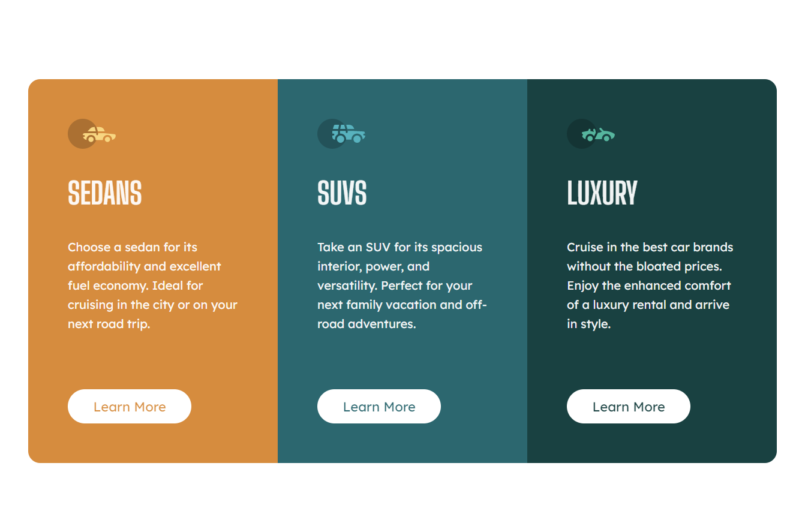

# Frontend Mentor - 3-column preview card component solution

This is a solution to the [3-column preview card component challenge on Frontend Mentor](https://www.frontendmentor.io/challenges/3column-preview-card-component-pH92eAR2-). Frontend Mentor challenges help you improve your coding skills by building realistic projects.

## Table of contents

- [Screenshot](#screenshot)
  - [Links](#links)
- [My process](#my-process)
  - [Built with](#built-with)
  - [What I learned](#what-i-learned)
  - [Continued development](#continued-development)
  - [Useful resources](#useful-resources)
- [Author](#author)
- [Acknowledgments](#acknowledgments)

## Screenshot



### Links

- Solution URL: [https://www.frontendmentor.io/solutions/3column-preview-card-component-JddbIVTFRP](https://www.frontendmentor.io/solutions/3column-preview-card-component-JddbIVTFRP)
- Live Site URL: [https://andreimaier.github.io/3-column-card/](https://andreimaier.github.io/3-column-card/)

## My process

### Built with

- Semantic HTML5 markup
- BEM naming convention
- Flexbox
- Mobile-first workflow

### What I learned

- to upgrade my CSS reset plate
- using CSS variables for colors and fonts
- hiding the main heading of the page using `position: absolute`, `overflow: hidden` and _negative margin_ to get it out of the viewport
- positioning the card vertically using `display: flex` on the `body`
- `margin-top: auto` will make the last element in a container float to the bottom of its parent (which in turn helps with **responsiveness**)
- `mix-blend-mode: screen` combined with `color: black` is a nifty way to set `color` to match the background. _used it to set the color of my buttons' text_
- which images need `alt` text and which should use `aria-hidden: true` instead
- used BEM naming convention for the first time and found it useful
- used `flex` property for the first time

```html
<h1 class="sr-only">3-column preview card component</h1>
```

```css
.card__button {
  color: black;
  mix-blend-mode: screen;
}
```

### Continued development

CSS Grid
`flex` property

### Useful resources

- [MDN - flex](https://developer.mozilla.org/en-US/docs/Web/CSS/flex) - This helped me make some sense of `flex` shorthand. I really like how it worked and I will continue trying to make sense of it in the next projects.
- [Markdown Guide](https://www.markdownguide.org/) - Used this documentation to write this README.

## Author

- Frontend Mentor - [@andreimaier](https://www.frontendmentor.io/profile/andreimaier)

## Acknowledgments

Learned **a lot** from [@MelvinAguilar](https://www.frontendmentor.io/profile/MelvinAguilar)'s [solution](https://www.frontendmentor.io/solutions/3column-preview-card-component--xxamoxSKH)
